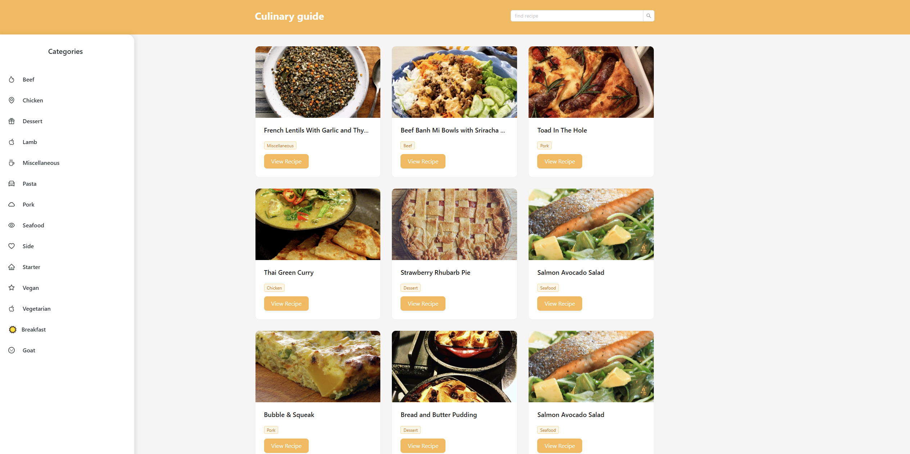

https://img.shields.io/badge/React-18.x-%252361DAFB?logo=react
https://img.shields.io/badge/Ant%2520Design-5.x-%25230170FE?logo=ant-design
https://img.shields.io/badge/API-TheMealDB-%2523F50157

Recipe Finder — это современное и интуитивно понятное веб-приложение для поиска и изучения кулинарных рецептов со всего мира. Построено на React с использованием UI-фреймворка Ant Design.

✨ Возможности (Текущие и планируемые)
✅ Реализовано
Главная страница: Отображение случайных рецептов в виде сетки.

Динамическая подгрузка: Кнопка "Load More" подгружает по 9 новых случайных рецептов.

Детальный просмотр: Клик по карточке рецепта открывает боковую панель (Drawer) с подробной информацией:

Название и категория

Фотография блюда

Ингредиенты и их меры

Пошаговые инструкции по приготовлению.

Адаптивный UI: Чистый и современный интерфейс, созданный с помощью Ant Design, который отлично выглядит на всех устройствах.

🚧 В процессе разработки
Поиск рецептов: Функция поиска по названию блюда (интерфейс готов, функционал в разработке).

Фильтр по категориям: Просмотр рецептов по выбранным категориям (e.g., Dessert, Seafood, Vegetarian). Интерфейс списка категорий уже реализован.

🛠 Технологии
Фронтенд: React 18

UI Библиотека: Ant Design (Icons, Layout, Cards, Drawer, Button, etc.)

HTTP Клиент: fetch API 

Источник данных: TheMealDB API - бесплатная и открытая API база данных рецептов.

